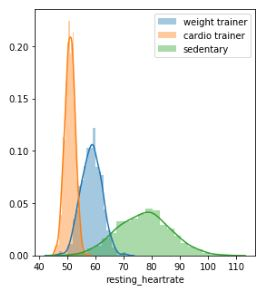
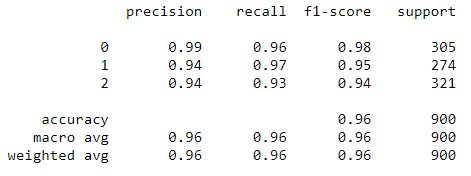
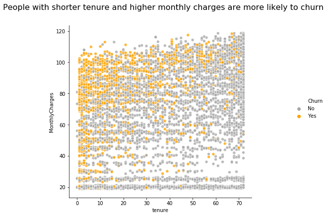
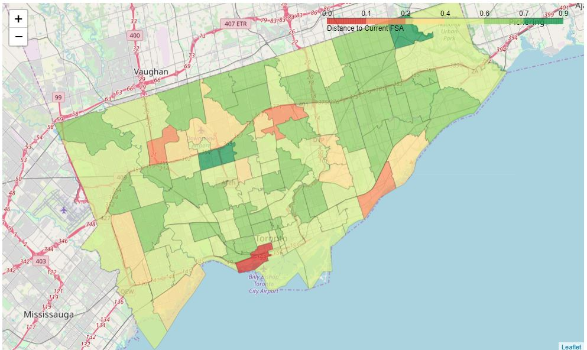
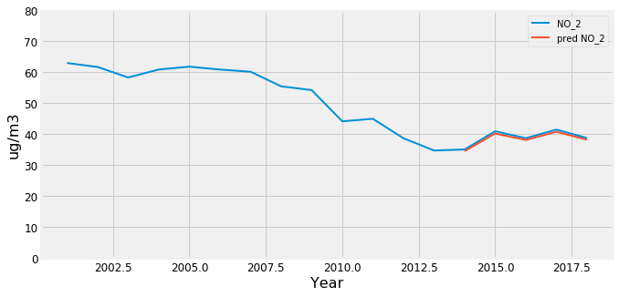
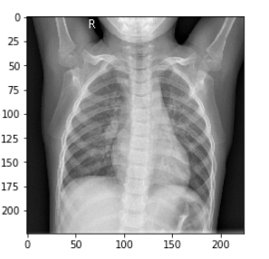
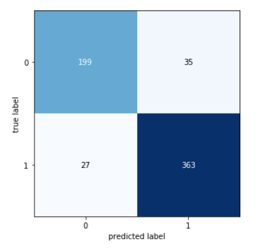
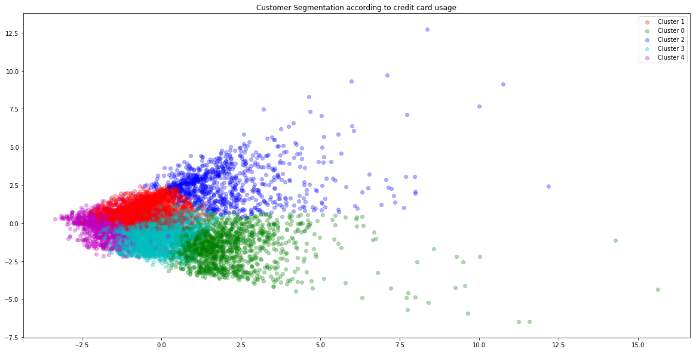

# *Data Science Portfolio*
#### -*Harshul Varma*
***
## About me:

Data Science professional with a heart and passion for innovation, creative problem solving and a mindset of getting things done. I am a quick learner with proven collaborative experience in a fast-paced cross functional environment. I have a keen interest in leveraging my analytical and research skills with knowledge and experience in data science for data driven decisions and applications. 

Tools: Python (pandas, matplotlib, seaborn, plotly, scikit-learn, networkX, tensorflow, Keras), SQL, Tableau, Spark 

[LinkedIn](https://www.linkedin.com/in/harshulvarma/)

***
## Projects:

### [Health Lifestyle Prediction App](https://nbviewer.jupyter.org/github/harshulvarma/Portfolio/blob/master/health_lifestyle_prediction_app.ipynb)

Classifying the health lifestyle of users based on simple input features such as resting heartrate and BMI. Focus of the project was feature selection and hyperparameter tuning of the machine learning model and deployment of a web app on Heroku using streamlit. App can be accessed here: https://health-lifestyle-prediction.herokuapp.com/

 

***

### [IBM Customer Churn Prediction](https://nbviewer.jupyter.org/github/harshulvarma/Portfolio/blob/master/CustomerChurn.ipynb)

Predicting churn using XGBoost classifier and identifying the features that can be used to predict churn using EDA and feature importance

***
### [Finding Similiar Neighborhoods -Toronto](https://nbviewer.jupyter.org/github/harshulvarma/Portfolio/blob/master/Finding_Similar_Neighborhoods.ipynb)
Recommending neighbourhoods within Toronto to home movers using K-Means clustering based on postal code data scraped from websites and popular venues retrieved from Foursquare API

***

### [Air quality analysis and prediction - Madrid](https://nbviewer.jupyter.org/github/harshulvarma/Portfolio/blob/master/air_quality_analysis_and_prediction_Madrid.ipynb)
Visualised 18 years of time series data of Madrid’s air pollution to discover trends and seasonality, clustered air stations in Madrid based on pollutant levels using K-means to find key areas in Madrid with highest pollution and finally forecasted pollution level for next 2 years by modelling and evaluating a Long Short-Term Memory-Recurrent Neural Network (LSTM-RNN) using Keras and Tensorflow

***
### [Pneumonia detection in X-Ray Images](https://nbviewer.jupyter.org/github/harshulvarma/Portfolio/blob/master/Pneumonia_X-Ray_Images.ipynb)
Implemented transfer learning using fine-tuned ResNet50 architecture with data augmentation in Keras to predict Pneumonia in X-Ray images 

***

### [Segmenting customers based on Credit Card usage](https://nbviewer.jupyter.org/github/harshulvarma/Portfolio/blob/master/Credit_Card_User_Segmentation.ipynb)
Segmented customers based on credit card usage behaviour for banks to target clusters with appropriate marketing strategies and visualised the clusters using PCA

***

